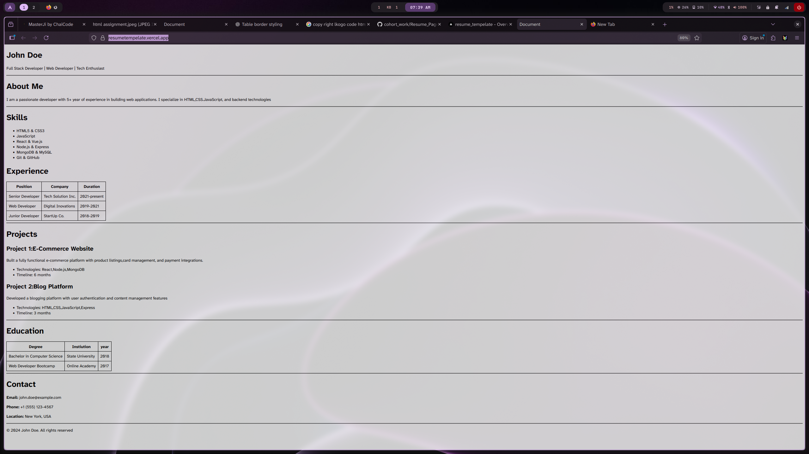

# Personal Portfolio Website (HTML Resume)

A simple, clean **personal portfolio / resume website** built using **pure HTML and CSS**.
This project showcases basic web development skills such as semantic HTML, tables, lists, and basic styling.

---

## 📌 Features

- Personal introduction section
- About Me description
- Skills list
- Work Experience table
- Projects section
- Education details
- Contact information
- Responsive-friendly structure using semantic HTML

---

## 🛠️ Tech Stack

- **HTML5**
- **CSS3** (inline `<style>` for simplicity)

---

## 🚀 Setup Instructions

Follow these steps to run the project locally:

1.  **Clone the repository**

    ```bash
    git clone <your-repo-url>
    ```

2.  **Navigate to the project folder**

    ```bash
    cd portfolio-html
    ```

3.  **Open the file**
    - Simply open `index.html` in any modern web browser
    - OR right-click → **Open with Browser**

No additional dependencies or installations are required.

---

## 📝 Usage

Edit the content inside `index.html` to replace:

- **Name**
- **Skills**
- **Experience**
- **Projects**
- **Contact details**

Customize the styling inside the `<style>` tag or move it to a separate CSS file.

### Can be extended into:

- A full portfolio website
- Resume hosting page
- Beginner frontend project submission

---

## 📸 Screenshots (Recommended)

Add screenshots of the website here for better evaluation.

**Example:**



_(You can add images later — totally fine.)_

---

## 📂 Project Structure

```text
portfolio-html/
│
├── index.html
└── README.md
```
